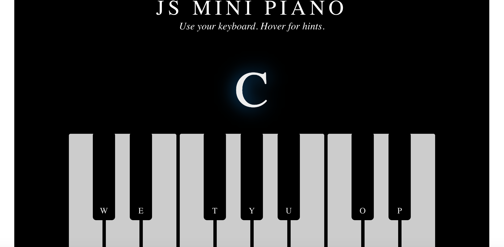

# mini-piano 🎹

This mini piano is created using HTML5, CSS, and Javascript.

https://mini-piano.herokuapp.com/

## How to:

To use this piano app you press the keys on your keyboard (hints show on hover which keys are which).

